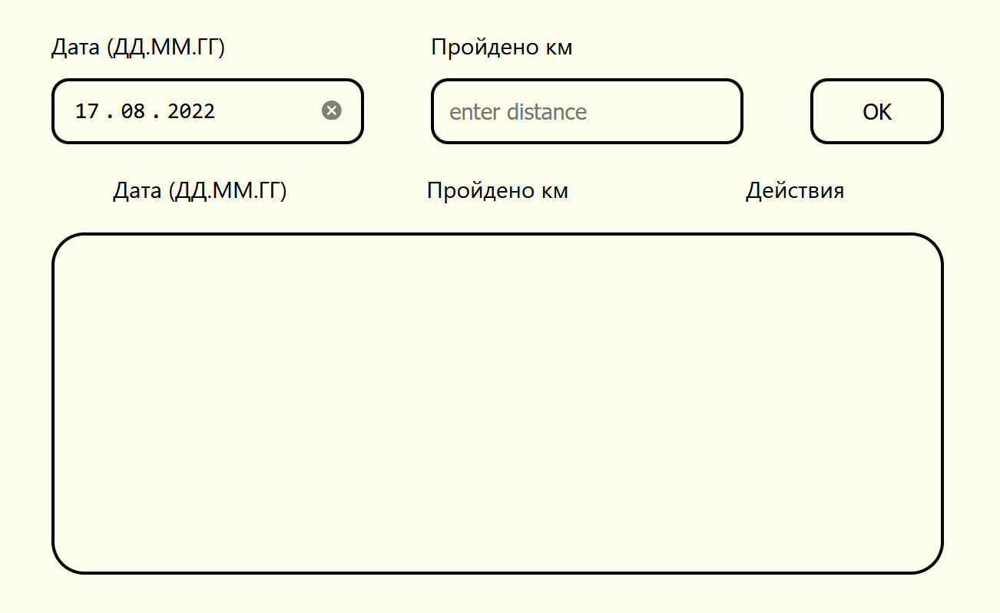

Компонент, реализующий запись пройденных километров.
===

Список сортируется по возрастанию даты. Дата является уникальным значением, при добавлении км на уже существующую дату значения введенных км сложатся.

Дата по умолчанию - сегодняшняя, по utc. Форматируется в вид дд-мм-гггг.

Кнопка карандашика переносит значения из списка обратно в форму для редактирования.
Крестик удаляет объект из массива.

